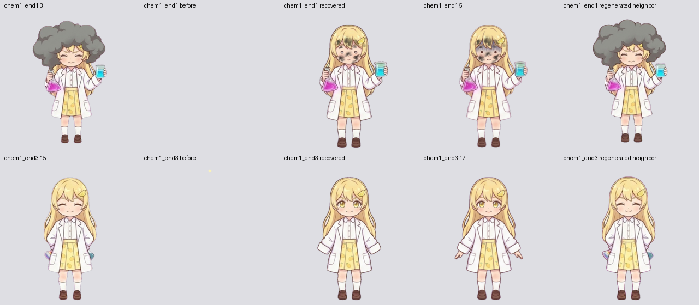

# 재생 안정성 수정 — 2026-10-05

`bee1b65`의 [검토](playback_stability_review.md)에서 확인한 종료 중복 처리와 원본 화학 엔딩의 빈 프레임을 수정한다. 이전 검토 로그와 해시는 수정 전 상태의 기록으로 보존한다.

## 종료 중복 처리

워치독은 종료 플래그를 발견하면 100ms 후 다시 확인한다. 정상 `ended` 이벤트가 그 사이 처리되면 복구하지 않는다. 재확인할 때 버퍼 소유자·화면 버퍼·전환·모드 변경·숨김 상태를 검사한다. 이벤트가 실제로 유실되어 같은 영상이 끝난 채 남아 있을 때만 기존 사이클 복구를 호출한다.

네이티브 종료 핸들러는 이미 되감아 `video.ended`가 거짓인 이벤트를 무시한다. 매 사이클 호출되는 핸들러는 유지하며, 로드 오류·타임아웃·재생 실패의 강제 완료는 이 조건을 거치지 않는다.

- 수정 전: 실제 종료 1회에 `emotionCycles`가 0→1→2. [실패 로그](../output/playback-fix/ended-race-before.log).
- 수정 후: 정상 종료 직전 워치독을 실행한 3사이클 모두 한 번만 증가하고 복구 경고가 없다. 이벤트 유실 시 한 번 복구하며 지연 이벤트·이전 버퍼 콜백은 무시한다. [통과 로그](../output/playback-fix/ended-race-after.log).

## 원본 화학 엔딩 알파 복구

과거 `slice_and_key.py`는 가장 위쪽 불투명 픽셀을 본체로 선택해 연기·별만 남길 수 있었다. 이미 수정된 최대 연결 성분 처리로 `sprites/raw/chem1_end1_*.jpg`, `sprites/raw/chem1_end3_*.jpg`를 임시 디렉터리에 다시 처리한 후 결함 PNG 두 장만 교체했다. 새 그림 생성이나 다른 포즈 교체는 없다.

| 프레임 | 수정 전 불투명 픽셀 | 수정 후 불투명 픽셀 |
| --- | ---: | ---: |
| `chem1_end1_04` | 0 | 61,519 |
| `chem1_end3_16` | 15 | 61,453 |

불투명 픽셀은 알파 > 240 기준이다. 두 장 모두 512×512 호환 원본이며, 기본 720px 자산은 변경하지 않는다. 앞뒤 포즈와 크기·위치를 비교했고, 회귀 검사는 알파 최대값뿐 아니라 본체 면적·높이·너비와 투명한 가장자리를 검사한다.



재현 절차:

```sh
python tools/slice_and_key.py --frames 'sprites/raw/chem1_end1_*.jpg' --outdir /tmp/sheddy-original-alpha/end1 --prefix chem1_end1
python tools/slice_and_key.py --frames 'sprites/raw/chem1_end3_*.jpg' --outdir /tmp/sheddy-original-alpha/end3 --prefix chem1_end3
# 두 결과 중 chem1_end1_04.png, chem1_end3_16.png만 각각 원본 프레임 디렉터리에 복사한다.
python tools/encode_holds.py anims/chem1_end1.json
python tools/encode_holds.py anims/chem1_end3.json
python tools/test_original_alpha.py
```

Python에는 Pillow·NumPy·SciPy, FFmpeg에는 libvpx-vp9가 필요하다. 기존 10fps·20/18틱·위젯 배율 0.7을 유지한다. 갱신한 PNG·영상 해시는 `rebuild_manifest.json`에 반영했다. `hd720_special.json`의 입력 장부 해시도 갱신했으며 HD 포즈와 영상은 바뀌지 않았다. 수정 전후 원본·프레임·영상·장부 해시는 [복구 증빙](../output/playback-fix/alpha-recovery.json)에 남긴다.

`deploy_pages.py --assets original`로 수정된 호환 영상과 위젯을 복사한 뒤 `--assets hd720 --require-reviewed`로 최종 기본 경로를 HD720으로 생성했다. [생성 로그](../output/playback-fix/deploy.log).

## 검증

검사 환경은 macOS headless Chrome과 libvpx-vp9다. OBS 앱 자체나 원격 Pages 서버는 실행하지 않았다.

| 검사 | 결과 | 원문 |
| --- | --- | --- |
| 종료 순서 통제 | 정상 3사이클, 유실 복구, 지연 이벤트·이전 버퍼 보호 통과 | [로그](../output/playback-fix/ended-race-after.log) |
| 본체 알파 회귀 | 수정 전 2건 실패 → 수정 후 통과 | [수정 전](../output/playback-fix/alpha-before.log), [수정 후](../output/playback-fix/alpha-after.log) |
| 전체 자산 감사 | 315영상·4,715 PNG·12,275틱·315 Pages 복사본, 알파 누락·포즈 대체 0 | [보고서](../output/playback-fix/asset-audit.json) |
| 위젯 제어 | 13항목 통과, 반복 재시작 4~8ms | [로그](../output/playback-fix/widget.log) |
| Pages 폴백 제어 | 13항목 통과, 반복 재시작 8~10ms | [로그](../output/playback-fix/pages-widget-fallback.log) |
| Pages 폴백 모드 전환 | 6모드 및 로드 실패·종료 이벤트 유실·숨김 복구 통과 | [로그](../output/playback-fix/pages-mode-switch.log) |
| 원본 화학 엔딩 / Pages 폴백 | 3클립 × 2사이클, 6 ended 통과 | [로그](../output/playback-fix/original-chem.log) |
| 감사 도구 단위 검사 | 포즈 대체·잘못된 hold 검출 등 3항목 통과 | [로그](../output/playback-fix/audit-tests.log) |

전체 연속 재생은 **6모드·107 상태/모드 조합** 모두 통과했다. 일반 39, 할로윈 28, 설날·크리스마스·어린이날·여름 각 10개를 중단 없이 순회했다. 각 상태의 두 사이클 유지와 대기 복귀를 확인했고 정상 경로의 워치독·미디어 경고는 없었다. [전체 상태 로그](../output/playback-fix/states.log), [검증 요약](../output/playback-fix/summary.json).

결론: 검토에서 발견한 두 결함을 수정하고 해당 회귀와 전체 연속 재생 검증을 통과했다. 로컬 Pages 생성물까지 반영했으며 원격 게시 여부는 이 검사의 범위에 포함하지 않는다.
