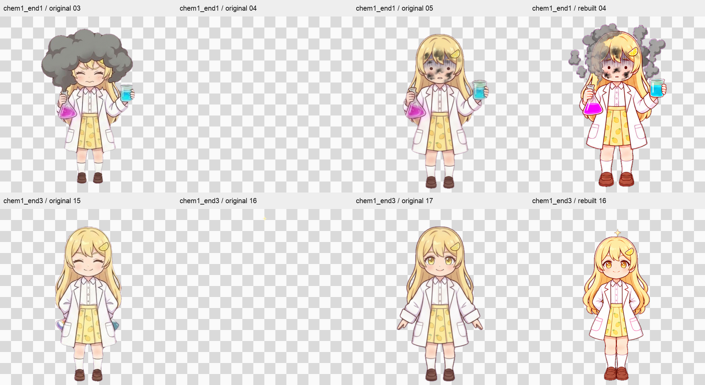

# 전체 애니메이션 재생 안정성 검토 — 2026-10-05

검토 기준은 `f670347`의 로컬 자산과 위젯이다. 전체 등록 영상 138개, 선택 가능한 일반·테마 상태, 모드 변신, 기존 512px 호환 경로를 포함한다. 검토 중 제품 코드와 이미지·영상은 수정하지 않았다.

후속 수정과 재검증은 [재생 안정성 수정 기록](playback_stability_fix.md)에 정리한다. 아래 실패 로그와 자산 해시는 수정 전 상태의 기록이다.

## 발견한 문제

**[P2] 워치독과 늦은 `ended` 이벤트가 같은 사이클을 두 번 처리한다.**

`widget.html:933`의 워치독은 `v.ended`가 참이면 즉시 `onCycleEnd()`를 호출한다. 아직 큐에 남은 네이티브 `ended` 이벤트가 뒤이어 도착하면 `widget.html:601`의 핸들러도 같은 콜백을 다시 실행한다. 첫 처리에서 이미 `currentTime=0`으로 되감았으므로 두 번째 처리 시점의 `video.ended`는 거짓이다. 반복 카운터가 두 번 증가해 자동 반복 상한이나 최소 대기 횟수를 실제보다 빨리 채울 수 있다.

- 첫 전체 순회는 설날 복주머니 검사 중 종료 판정에 실패했다. 상세 진단을 추가한 두 번째 순회에서는 야호 동작 후 대기 복귀 중 같은 실패를 재현했다. 이때 `idle1_loop`는 `ended=false`, `currentTime=0`, `duration=1.8`이었고 워치독 경고가 함께 기록됐다.
- 이벤트 직전에 워치독이 실행되는 순서를 통제한 검사에서도 한 번의 실제 영상 종료로 `emotionCycles`가 **0→1→2**가 됐다. 재현 명령은 `node tools/widget_ended_race_check.js`이며 현재 코드에서는 종료 코드 1로 실패한다.
- 설날 단독 순회와 복주머니 독립 재생 3회는 통과했다. 특정 영상 파일의 디코딩 실패로 보기보다는 공통 종료 처리의 경합으로 판단한다.
- 수정 방향: 같은 사이클의 종료는 한 번만 소비하도록 보호하고, 실제 종료 이벤트가 유실됐을 때의 워치독 복구는 유지해야 한다.

근거: [연속 순회 상세 실패](../output/playback-stability/states-confirmation.log), [종료 순서 통제 재현](../output/playback-stability/ended-race-assert.log).

**[P2] 512px 원본 화학 동작 2종에서 캐릭터가 한 프레임 사라진다.**

`?assets=original` 경로의 `chem1_end1` 4번 프레임은 알파 최대값이 28이며 보이는 픽셀이 1개뿐이다. `chem1_end3` 16번 프레임은 작은 별 장식 111픽셀만 남고 몸체가 없다. 두 영상은 10fps·0.7배속이므로 각 약 0.143초간 깜박임을 만든다. 기존 감사의 `opaqueMissingTicks` 경고는 압축 오차가 아니라 실제 잘못된 알파다.

- `sprites/chem1_end1/chem1_end1_04.png` → `sprites/anim_chem1_end1.webm`, 영상 0.4~0.5초 구간
- `sprites/chem1_end3/chem1_end3_16.png` → `sprites/anim_chem1_end3.webm`, 영상 1.6~1.7초 구간
- 기본 `hd720` 및 `rebuilt` 경로의 대응 프레임에는 몸체가 정상적으로 남아 있다.
- 재현·수정 방향: 원본 PNG의 알파 추출을 복구한 뒤 두 512px 영상을 재인코딩하고, 원본 해시와 Pages 복사본을 갱신해야 한다. 이번 검토에서는 원본 보존 상태를 변경하지 않았다.

## 검사 범위와 해석

- 자산 검사: 기존 전체 디코딩 감사의 315개 영상, 4,715 PNG, 315 Pages 복사본을 현재 SHA256과 대조했다. 감사 이후 바뀐 파일은 없다. 포즈 순서·타임스탬프·디코딩 알파 결과를 현재 자산에 적용할 수 있다.
- 클립 검사: `playClip`으로 모든 등록 영상을 실제 배율에서 두 번 완주하고 같은 버퍼를 되감는다. 실제 `ended`, 마지막 재생 위치, 크기, 최종 프레임 알파, 렌더 진행, 경고와 캐시 상한을 검사한다. 전체 프레임의 알파는 별도 자산 감사가 담당한다.
- 상태 검사: 원래 `setState`와 종료 콜백을 그대로 실행한다. 모든 선택 가능한 상태를 두 사이클 유지한 뒤 시작→반복→종료/outro→대기 순서와 대기의 실제 완주를 확인한다. 말하기는 마이크 활성 상태를 모사한다.
- 제어 검사: 단발 동작 자동 복귀, 무기한 유지, 큐, 숨김/복귀, 마이크 임계값·해제 지연, 자동 추첨, 로드 실패, 워치독 회복, 6개 모드 전환을 기존 회귀 검사로 확인한다.
- 비교 경로: 기본 720px, 원본 512px, Pages 재구성 512px의 rVFC 미지원 폴백. 실제 서버 지연이나 OBS 앱 자체의 GPU/CEF 조합은 이 로컬 headless Chrome 검사의 범위 밖이다.
- `maxGap`은 50ms 간격으로 관측한 캔버스 그리기 사이 최대 간격이다. 네이티브 영상 프레임 전달 시간과 폴백 타이머의 렌더 횟수는 같지 않으므로 두 경로의 수치를 성능 우열로 해석하지 않는다.

## 실행 결과

| 검사 | 결과 |
| --- | --- |
| 기본 HD720 클립 전체 | 138클립 × 2사이클, 276 ended 통과 |
| 원본 512px 클립 전체 | 138클립 × 2사이클, 276 ended 통과; 별도 알파 감사에서 위 2개 결함 확인 |
| Pages 재구성 512px + rVFC 폴백 | 138클립 × 2사이클, 276 ended 통과 |
| 실제 상태 머신 | 6모드·107 상태/모드 조합 검사. 개별 성공 기록은 확보했으나 연속 순회 2회에서 워치독 경합 실패 |
| 모든 종료 분기 | 화학 3개·제빵 10개·연금술 3개 통과 |
| 기본/Pages 폴백 일반 제어 | 각 13개 회귀 항목 통과 |
| Pages 폴백 테마 제어 | 5개 테마의 선택·복귀·마이크·유지·숨김·자동 추첨 통과 |
| Pages 폴백 모드 전환 | 6모드와 로드 실패·종료 이벤트 유실·숨김 복구 통과 |
| 정책/측정 단위 테스트 및 포즈 감사 테스트 | Node 10개 + Python 3개 통과 |

클립 검사 합계는 **414회·828 ended**다. 실제 상태 검사 107조합의 범위는 일반 39, 할로윈 28, 설날·크리스마스·어린이날·여름 각 10개다. 할로윈의 연금술 별칭을 포함하므로 기본 ANIMS 엔트리 개수와 같지 않다. 12개 변신 영상은 전체 클립 검사와 6모드 전환 검사에 포함된다.

- `hd720` 관측 최대 그리기 간격: 251ms.
- `original` 관측 최대 그리기 간격: 250ms.
- `rebuilt-fallback` 관측 최대 그리기 간격: 103ms.

검사 환경은 macOS의 headless Chrome이다. OBS 앱 직접 실행, 원격 Pages의 네트워크 상태, 모든 GPU/CEF 버전을 보증하는 검사는 아니다. 클립 단독 검사에서는 예상하지 않은 워치독·미디어 오류가 없었다. 실제 상태 연속 순회에서는 워치독 경합이 발생했다. 별도의 실패 복구 회귀 항목에서는 의도적으로 오류를 주입했다.

원문과 범위: [결과 요약](../output/playback-stability/summary.json), [상태별 재생](../output/playback-stability/states.log), [자산 해시 검증](../output/playback-stability/source-validation.json), [제어 회귀 결과](../output/playback-stability/control-checks.json). 각 실행의 원문 로그는 `output/playback-stability/`에 보관한다.

결론: 영상 파일 자체는 모든 등록 클립의 두 사이클 완주를 확인했다. 전체 플레이어를 안정적이라고 판정할 수는 없다. 기본 720px에도 영향을 주는 종료 중복 처리 경합과 원본 512px의 2개 빈 프레임을 수정해야 한다.
