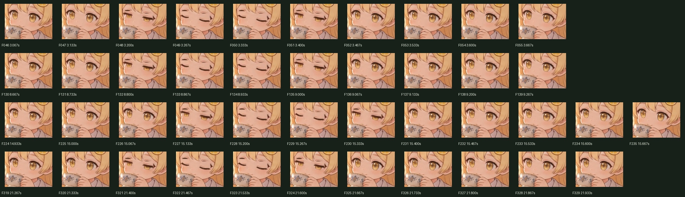

# Just Chatting 방송 배경 검수

2026-10-08. 연구실·강의실·르네상스 카페·달빛 산책길 네 편을 검수했다.
각 MP4는 1920×1080, 고정 15fps, 24초/360프레임, H.264/yuv420p, 오디오 트랙 없음이다.

## 요청과 결과

| 요청 | 결과와 확인 방법 |
| --- | --- |
| 프로젝트의 셰디펫 사용 | 금발·레몬 머리핀·흰 가운 캐릭터를 사용한 v2 콘셉트 네 장을 입력으로 사용. 전체 구도와 얼굴 검수판 확인 |
| 16:9 풀스크린, 약 15fps | 네 편 모두 1920×1080, 15/1fps. ffprobe의 모든 프레임 PTS가 `index / 15`와 일치 |
| 최소 움직임 | 머리·가슴 주변의 작은 호흡, 미세한 머리카락 움직임, 주기당 네 번 눈 깜빡임. 카메라와 큰 자세는 고정 |
| 잔잔한 이펙트 | 실내 먼지·빛줄기·가장자리 보케, 카페 찻잔·주전자 주변의 김, 산책길 별빛·반딧불·잎 흔들림 |
| 덜 스산한 산책길 | 길과 캐릭터를 구분할 수 있는 달빛을 유지하고 작은 반딧불 추가. 짙은 안개나 번쩍이는 효과 없음 |
| 방송에서 반복 사용 | 렌더러의 0초/24초 픽셀이 완전히 동일. 최종 MP4의 마지막→첫 프레임 차이도 별도 측정 |

## 프레임 전수 확인

`python3 tools/audit_broadcast.py`가 최종 MP4 **1,440프레임 전체**를 RGB로 디코딩했다.
프레임 수·PTS·해상도·코덱·무음, 프레임별 해시, 암전 여부, 인접 프레임 변화량과 반복 경계를 검사했다.
각 얼굴을 열린 눈/반쯤 감은 눈/감은 눈 기준 이미지와 비교해 **모든 프레임의 표정 순서**도 확인했다.
프레임은 각 편에서 360개 모두 서로 다른 해시를 갖는다.

| 장면 | 확인한 프레임 | 깜빡임 | 최대 인접 프레임 평균 차이 | 끝→처음 평균 차이 |
| --- | ---: | ---: | ---: | ---: |
| 연구실 | F000–F359, 360개 | 4회 | 1.1411 | 1.6904 |
| 강의실 | F000–F359, 360개 | 4회 | 0.9072 | 1.4241 |
| 카페 | F000–F359, 360개 | 4회 | 1.2968 | 1.8703 |
| 산책길 | F000–F359, 360개 | 4회 | 1.2576 | 1.9059 |

차이는 RGB 0–255 기준 전체 화면 평균이다. 손실 압축 때문에 MP4 반복 경계가 비압축 렌더러처럼 0이 되지는 않는다.
이 값만으로 국소적인 그림 오류를 판정하지 않고 아래의 시각 검수를 함께 수행했다.

- 장면별 `all-frames-1.jpg`부터 `all-frames-6.jpg`까지 **24장 전부**를 열어 60프레임씩 확인했다. 빈 프레임·구도 이탈·전체 밝기 급변·큰 배경 뒤틀림을 발견하지 못했다.
- 네 장면의 `blink-details.jpg` **4장 전부**에서 16회의 깜빡임을 확인했다. 검사 범위는 F046–055, F130–139, F224–235, F319–329이다.
- 눈 감김은 시작 프레임 F048/F132/F227/F321에서 `반감음 → 감음 → 감음 → 반감음 → 열림`으로 진행된다. 얼굴 주변과 찻잔 위치가 유지되고 반투명 홍채 잔상이 사라진 것을 확인했다.
- 검수판은 축소 전체 화면과 얼굴 크롭을 함께 사용했다. 각 프레임을 1080p 전체 화면으로 하나씩 수동 재생한 검수와는 구별된다.

## 발견한 문제와 수정

초기 구현은 열린 눈과 감은 눈을 투명도로 섞어 중간 프레임에 홍채가 겹쳤다.
반쯤 감은 눈 원화를 추가하고 세 가지 표정을 불투명하게 교체하도록 수정했다.
보강된 검사를 기존 출력에 실행했을 때 연구실 F048에서 실패했고, 수정된 네 출력에서는 전부 통과했다.

카페의 기존 F049는 정상 반감음보다 열린 눈/감은 눈 50% 혼합에 더 가까웠다.
수정된 F048는 반감음 원화에 가장 가깝다. 수치와 영상 해시는 [전후 비교 JSON](blink-regression.json)에 기록했다.

| 수정 전 | 수정 후 |
| --- | --- |
|  |  |

렌더 완료 후 Chrome 보조 프로세스의 stderr 파이프 때문에 Node가 남는 현상도 확인했다.
종료 처리에서 소유한 파이프를 닫았고, `node tools/render_broadcast.js --qa`의 네 장면 검사와 정상 종료를 확인했다.

## 근거와 재현

- [최종 영상·소스 SHA-256, 검사 요약](../../output/broadcast/sheddy-just-chatting/qa/frame-review/summary.json)
- 프레임별 PTS·해시·표정 거리: [연구실](../../output/broadcast/sheddy-just-chatting/qa/frame-review/lab/frames.json), [강의실](../../output/broadcast/sheddy-just-chatting/qa/frame-review/lecture/frames.json), [카페](../../output/broadcast/sheddy-just-chatting/qa/frame-review/cafe/frames.json), [산책길](../../output/broadcast/sheddy-just-chatting/qa/frame-review/mountain/frames.json)
- 눈 깜빡임 확대판: [연구실](../../output/broadcast/sheddy-just-chatting/qa/frame-review/lab/blink-details.jpg), [강의실](../../output/broadcast/sheddy-just-chatting/qa/frame-review/lecture/blink-details.jpg), [카페](../../output/broadcast/sheddy-just-chatting/qa/frame-review/cafe/blink-details.jpg), [산책길](../../output/broadcast/sheddy-just-chatting/qa/frame-review/mountain/blink-details.jpg)
- [렌더러 루프·움직임·영상 규격 검사](../../output/broadcast/sheddy-just-chatting/qa/verification.json)
- 배포 ZIP을 다시 열어 포함된 네 MP4·미리보기·사용법·프롬프트가 현재 파일과 바이트 단위로 같은지 확인했다.
- 최종 파일로 미리보기를 새로고침한 뒤 장면 버튼을 차례로 눌렀다. 네 장면 모두 `paused=false`, `loop=true`, `duration=24`, `videoWidth=1920`, `videoHeight=1080`을 확인했고 선택 표시·영상 설명·다운로드 링크도 함께 바뀌었다.

```bash
node tools/render_broadcast.js
python3 tools/audit_broadcast.py
```

Node 22+, Chrome, ffmpeg/ffprobe, Python 3 + Pillow가 필요하다.
전체 프레임 검수판은 `output/broadcast/sheddy-just-chatting/qa/frame-review/{scene}/all-frames-{1..6}.jpg`에 재생성된다.
검수판 이미지 24장은 저장소 용량을 줄이기 위해 Git에서 제외하고 프레임별 JSON과 표정 확대판은 보관했다.

## 검증 범위와 한계

컨셉 원본은 약 1672×941이며 Full HD로 맞춘 시네마그래프다.
요청한 최소 움직임에 맞춰 발걸음·필기·입모양 연동은 구현하지 않았다.
실제 OBS 송출과 장시간 방송은 검증하지 않았으며, [사용법](../../output/broadcast/sheddy-just-chatting/OBS-사용법.txt)에 적용 방법을 남겼다.
기존 위젯 실행 코드와 sprites를 변경하지 않아 위젯 상태 머신 회귀 검사는 실행하지 않았다.
